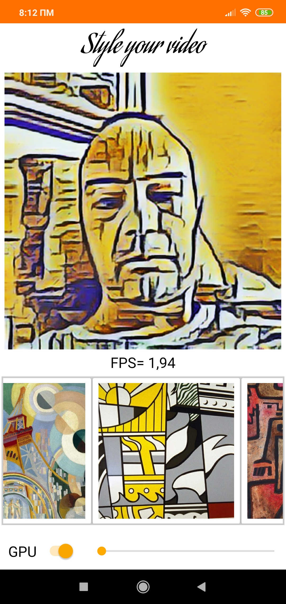

# video_style_transfer
Tensorflow style transfer in video
____________________________________________________________

# This is a project of style transfer of famous paintings in videos
and implement Tensorflow Lite models inside android application.
Android app will use Camera2 library for images.

Check this repo if you want to get an idea of Camera2 API usage, MVVM, KOIN_DI. Also example of Tensorflow lite models inside android.

This project is in __Kotlin__ language and has:

1) Camera2 API usage.
2) Tensorflow Lite usage with .tflite models
also:

3) Databinding
4) MVVM with Coroutines
5) Koin DI

**What is Style Transfer?**

Artistic style transfer is an optimization technique used to take two images: a content image and a style reference image (such as an artwork by a famous painter) and blend them together so the output image looks like the content image, but “painted” in the style of the style reference image.

The on-device model comes with several benefits. It is:

- Faster: The model resides on the device and does not require internet connectivity. Thus, the inference is very fast and has an average latency of only a few milliseconds.
- Resource efficient: The model has a small memory footprint on the device.
- Privacy-friendly: The user data never leaves the device and this eliminates any privacy restrictions.

**Details how application was developed**
[Medium article](https://medium.com/@farmaker47/android-implementation-of-video-style-transfer-with-tensorflow-lite-models-9338a6d2a3ea)

**Screenshot**

